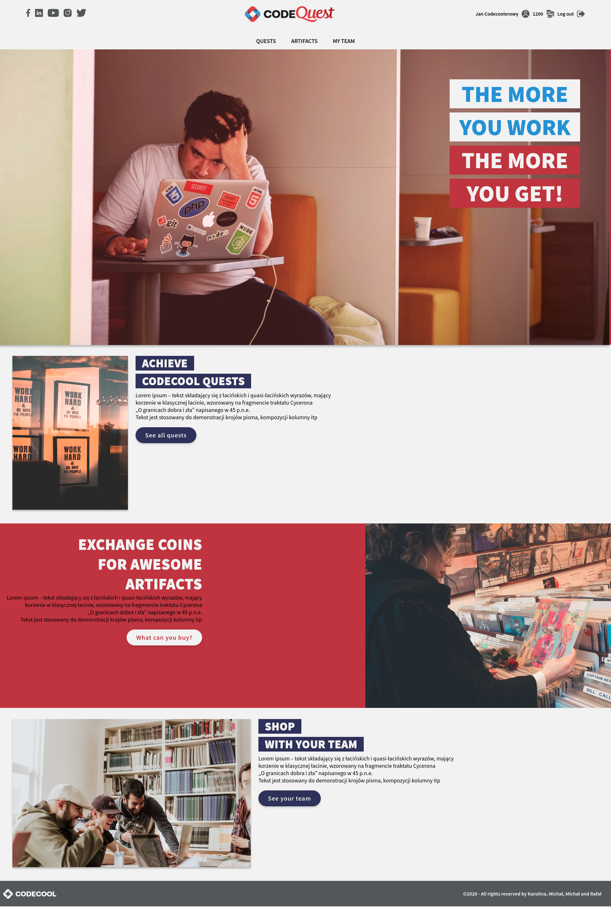
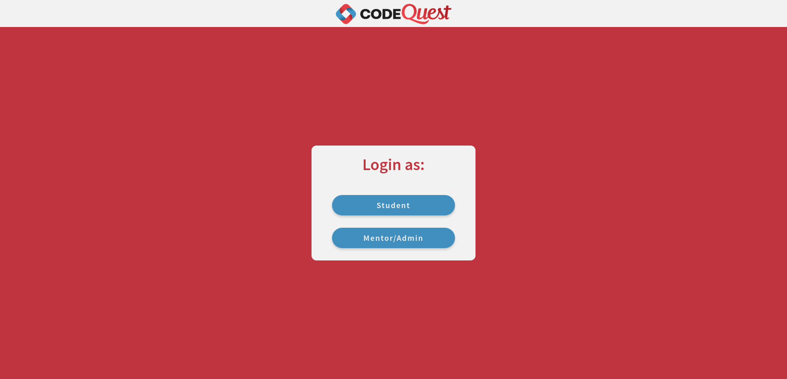

# The story

The store is the platform where you can use your well earned coolcoins to buy certain events.
The store items do not have any material value they represent activities or events that enhance the Codecool experience.
The store offers two type of items basic and extra (magic).
Basic items are meant for individual buyers while extra items are designed to be purchased by a group of students.
Assortment and prices can be changed at the beggining of week, depending on demand and supply.

# Installation:
After download the project please process these steps:
1. Create the new database in your PostgreSQL:
```sql
CREATE DATABASE queststore;
```
2. Check correct data in *database.properties* file in *resources* directory. 
3. Run script "create_db.sql" from *resources* directory.
4. Run script "insert_data_into_db.sql" from *resources* directory.
5. You can run *main* method from *Main.java* file for test your environment. If everything is OK, you should view all *classes* entities in database.
6. Now you can run app by mvn:
```bash
   mvn jetty:run 
```

# Images:
Main page:



Login Page:



# Branches:
## dev
Actual branch for attach the back-end layer to the front-end layer.
## views
Actual branch for front-end.
## list-pages-correction
Branch is used for try eliminate multiply CSS files.
## include-jsp
Divide header and footer section to another files and include they for jsp include.

# Status
Project is: finite.

This project was built to learn Java EE and JSP. These purposes were fulfilled, and the project has been completed.
